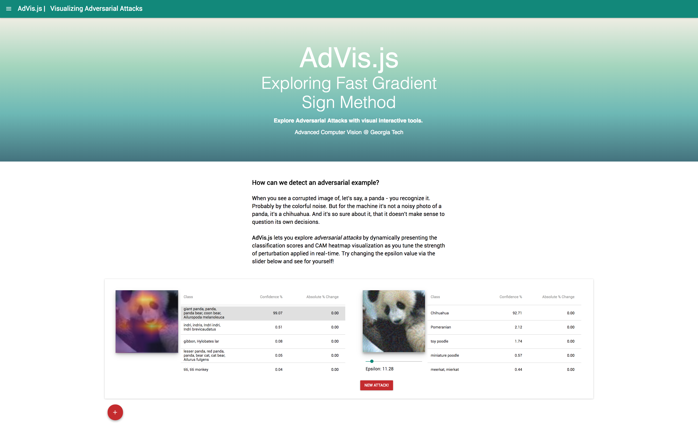

# AdVis.js

AdVis.js is an interactive webtool that lets anyone to explore **adversarial attacks** by dynamically updating the classification scores and Class Activation Map (CAM) heatmap visualization of an input image as one tunes the strength of perturbation (epsilon in Fast Gradient Sign Method) applied to generate the adversarial example, all rendered in real-time. Our image classification architecture uses MobileNetV1 as backbone and gradient calculations for depthwise convolution with respect to the input image. You can now upload your own images and animate the CAM differential with different epsilon multipliers on-demand. **Demo is live at [http://www.advisjs.com](http://www.advisjs.com)**.

The JavaScript webtool is built with a TensorFlow.js backend and a React frontend referencing open source components. It is the brainchild of *Advanced Computer Vision* taught by James Hays at Georgia Tech, and has been featured on [YouTube](https://www.youtube.com/watch?v=JjlV62_kGUc). **Note: If you use our work, please [cite][citation] with the BibTeX provided [below][citation].**

- **Developers**: Jason Lin, Dilara Soylu
- **Research Poster**: [here](http://www.jlin.xyz/papers/advis_poster_v2.pdf)



 
## Usage

Download or clone this repository:


```bash
git clone https://github.com/jaxball/advisjs.git
```

`cd` into the cloned repo and install the required depedencies:

```bash
yarn

```

To run, type:

```bash
yarn start

```

## Citation
Please cite this project in your publications if it helps your research. The following is a BibTeX reference.
```
@techreport{advis18acv,
  author = {Lin, Jason and Soylu, Dilara},
  title = {{AdVis: Visualizing and Attributing ML Attacks to Adversarial Examples}},
  institution = {Georgia Institute of Technology},
  year = {2018},
  note = {Accessed: [Insert date here]}
}
```

## To Do

- [ ] Input slider to choose from 1000 classes for targeted adversarial attack 
- [ ] Port Robust Adversrial Example from IPython notebook
- [ ] Adversarial Training with FGSM
- [ ] Visualize perturbations in real time? i.e. scale the negative values so we have 0 in the middle of the RGB values
- [ ] Explore Saliency Detection implementation (JS) methods

## License

MIT License. See [`LICENSE.md`](LICENSE.md).

## Contact

For questions or support [open an issue][issues].

[issues]: https://github.com/jaxball/advis.js/issues "Issues"
[citation]: https://github.com/jaxball/advis.js#citation "Citations"
